<p align="center">
  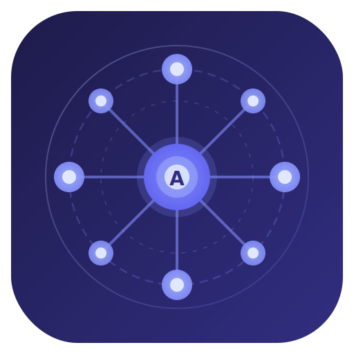
</p>

<h1 align="center">AgentHub</h1>

<p align="center">
  <strong>Self-hosted command center for your AI agents</strong><br/>
  Route conversations to specialized agents, build automated workflows,<br/>
  evaluate models head-to-head, and monitor everything from one dashboard.
</p>

<p align="center">
  <a href="#install">Install</a> ·
  <a href="#features">Features</a> ·
  <a href="#screenshots">Screenshots</a> ·
  <a href="#architecture">Architecture</a> ·
  <a href="#developing-adapters">Adapters</a> ·
  <a href="#contributing">Contributing</a>
</p>

---

AgentHub is a **pure presentation and routing layer**. It doesn't run models or handle inference — it connects to agent gateways (Hermes, OpenClaw, OpenAI-compatible APIs, WebSocket endpoints, or any custom adapter) and gives you a unified interface to manage them all.

Everything runs locally. Your data stays in a SQLite database on your machine. No cloud dependency, no telemetry, no vendor lock-in.

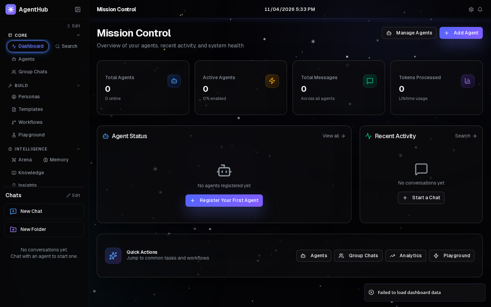

---

## Install

### npm / npx (quickest)

```bash
npx agenthub
```

Or install globally:

```bash
npm install -g agenthub
agenthub --port 3000
```

### Desktop App (Electron)

Download the latest release for your platform from [**GitHub Releases**](https://github.com/Albaloola/AgentHub/releases/latest):

| Platform | Package | Arch |
|----------|---------|------|
| **Windows** | [Setup Installer (.exe)](https://github.com/Albaloola/AgentHub/releases/latest) | x64, arm64 |
| **Windows** | [Portable (.exe)](https://github.com/Albaloola/AgentHub/releases/latest) | x64, arm64 |
| **macOS** | [Disk Image (.dmg)](https://github.com/Albaloola/AgentHub/releases/latest) | Intel (x64), Apple Silicon (arm64) |
| **macOS** | [ZIP (.zip)](https://github.com/Albaloola/AgentHub/releases/latest) | Intel (x64), Apple Silicon (arm64) |
| **Linux** | [AppImage](https://github.com/Albaloola/AgentHub/releases/latest) | x64 |
| **Linux** | [Debian/Ubuntu (.deb)](https://github.com/Albaloola/AgentHub/releases/latest) | x64 |
| **Linux** | [Fedora/RHEL (.rpm)](https://github.com/Albaloola/AgentHub/releases/latest) | x64 |
| **Linux** | [Tarball (.tar.gz)](https://github.com/Albaloola/AgentHub/releases/latest) | x64 |

> All packages are available on the [Releases page](https://github.com/Albaloola/AgentHub/releases/latest). Pick the one that matches your OS and architecture.

### AUR (Arch Linux)

```bash
yay -S agenthub-bin     # prebuilt binary
yay -S agenthub-git     # build from source
```

### Docker

```bash
docker compose up
```

Or standalone:

```bash
docker run -p 3000:3000 -v agenthub-data:/app/data ghcr.io/albaloola/agenthub
```

### Quick Install Scripts

**Linux / macOS** — auto-detects OS and architecture:
```bash
curl -fsSL https://raw.githubusercontent.com/Albaloola/AgentHub/main/packaging/install.sh | bash
```

**Windows (PowerShell):**
```powershell
irm https://raw.githubusercontent.com/Albaloola/AgentHub/main/packaging/install.ps1 | iex
```

### From Source

```bash
git clone https://github.com/Albaloola/AgentHub.git
cd AgentHub
npm install
cp .env.example .env.local
npm run dev
```

Open [http://localhost:3000](http://localhost:3000). The app seeds itself with a **Mock Echo Bot** for testing — no external agents required to explore the UI.

---

## Screenshots

<table>
<tr>
<td width="50%">

**Mission Control Dashboard**
Overview of agents, recent activity, and system health at a glance.


</td>
<td width="50%">

**Agent Management**
Configure agents, adapters, capability weights, and fallback chains.

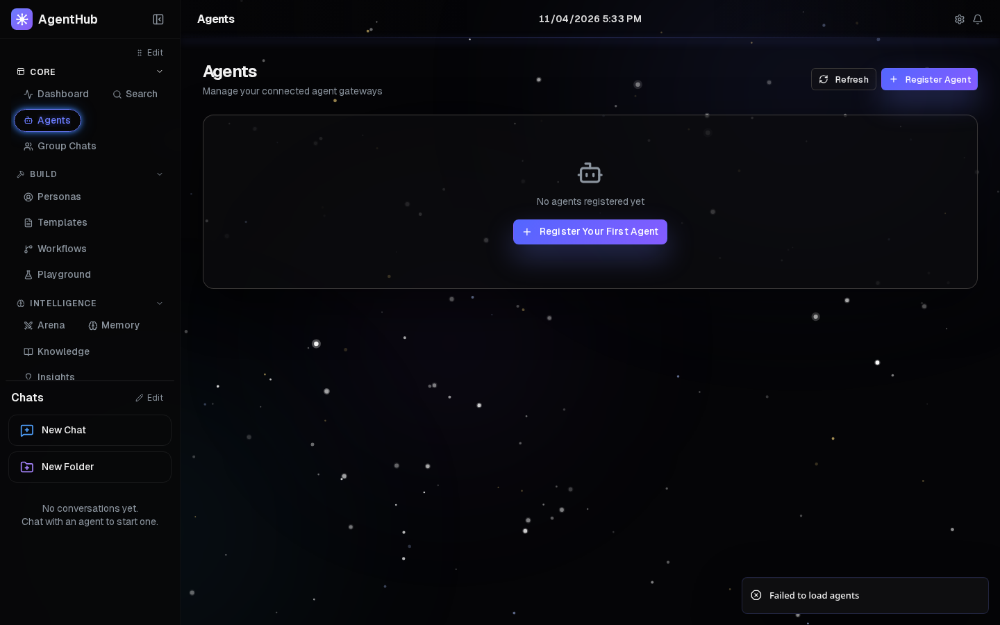
</td>
</tr>
<tr>
<td>

**Visual Workflow Builder**
Drag-and-drop pipeline builder with agent, condition, delay, and output nodes.

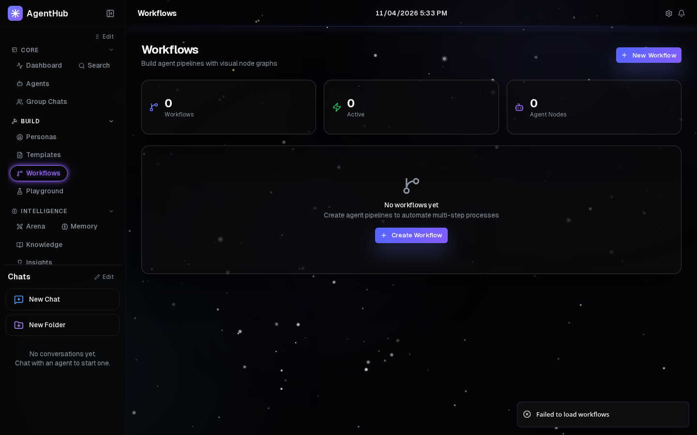
</td>
<td>

**Arena — Head-to-Head Evaluation**
Compare agent responses side by side with voting and leaderboard.

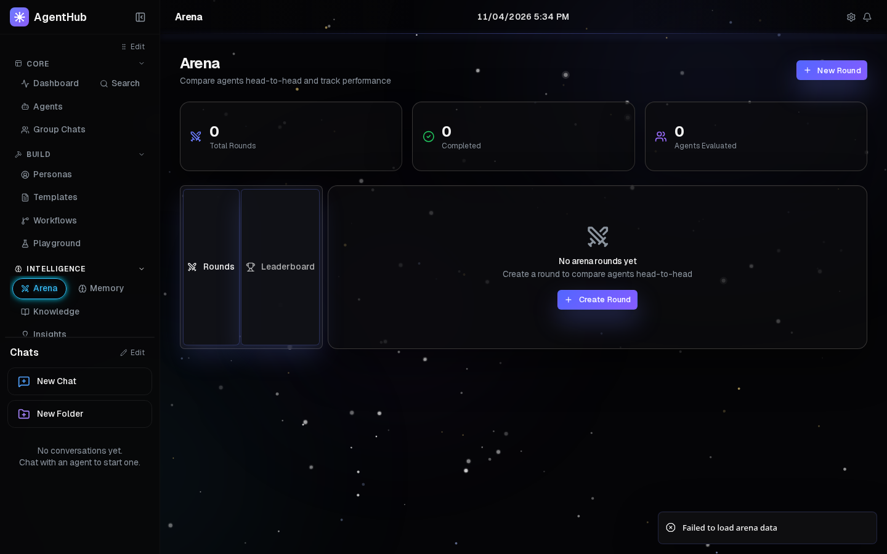
</td>
</tr>
<tr>
<td>

**Execution Traces**
Span waterfall visualization with thinking panels, tool calls, and subagent trees.

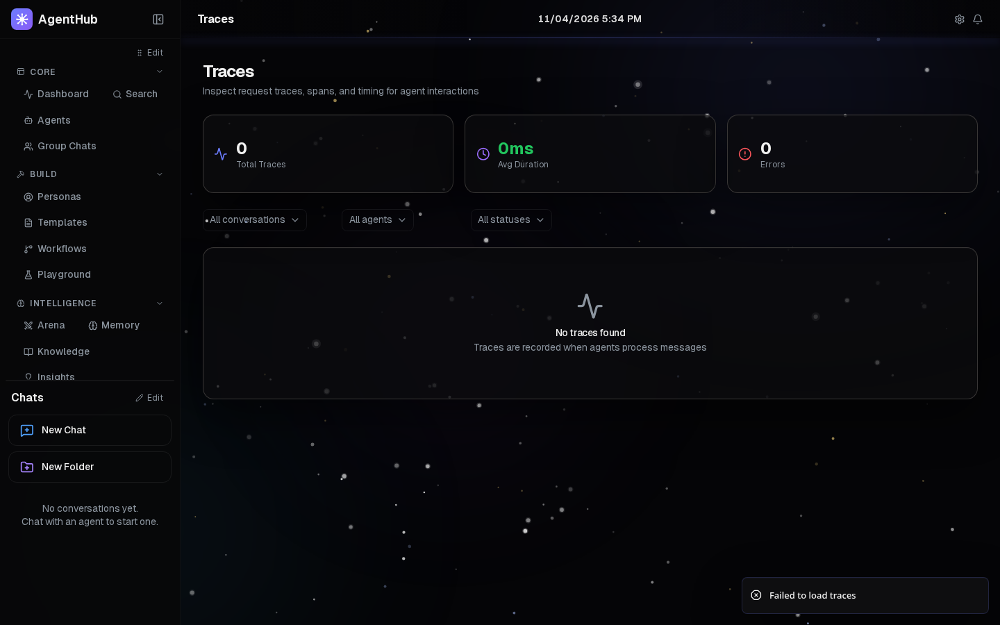
</td>
<td>

**Analytics**
Agent performance tables, token distribution, and status overview.

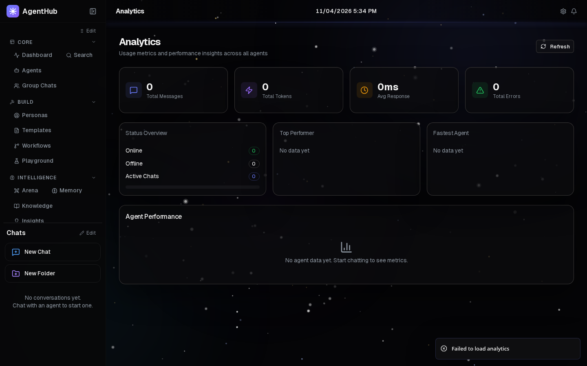
</td>
</tr>
<tr>
<td>

**Knowledge Bases**
Upload documents (TXT, MD, PDF, JSON, CSV), automatic chunking, RAG management.

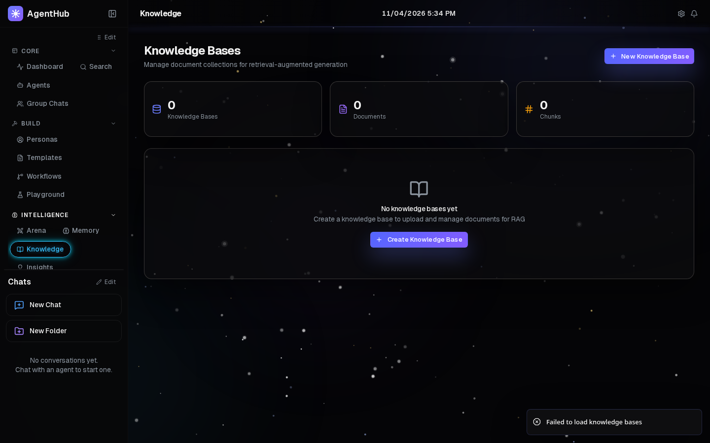
</td>
<td>

**Prompt Playground**
Split-pane editor with streaming responses and version history.

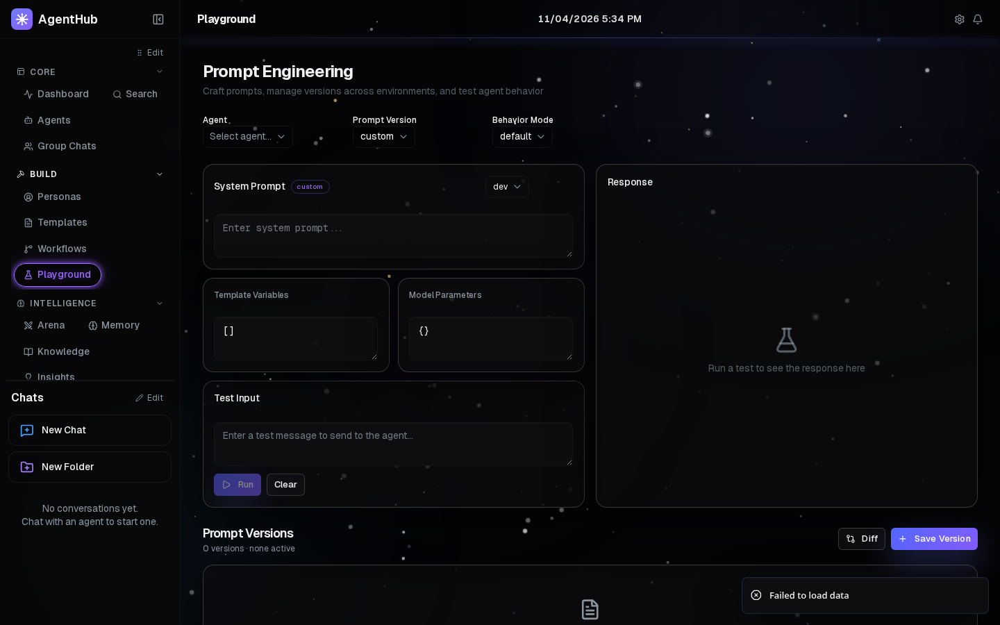
</td>
</tr>
<tr>
<td>

**Personas Library**
9 specialized personas across engineering, security, creative, and more.

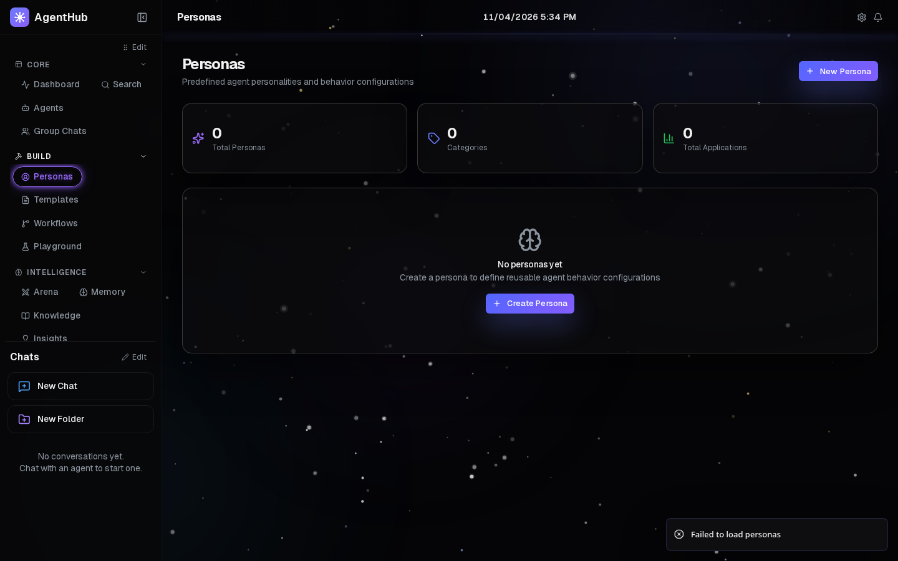
</td>
<td>

**Settings & Themes**
6 theme presets, accent colors, density settings, custom CSS.

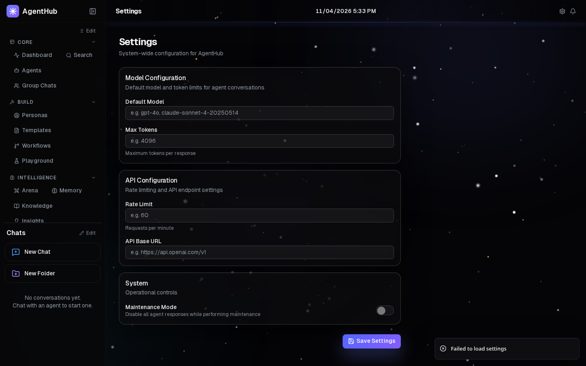
</td>
</tr>
</table>

---

## Features

### Chat & Communication

- **Streaming chat** with SSE, markdown rendering, syntax highlighting, and copy buttons
- **Group chat** with discussion, parallel, or targeted response modes
- **Message editing**, regeneration, threading, pinning, and voting
- **File attachments** with drag-and-drop upload
- **Slash commands** per gateway, behavior modes per conversation
- **Agent handoff protocol** for seamless agent-to-agent transfers
- **Artifacts panel** — auto-detects HTML/SVG/JSX and renders in a sandboxed iframe

### Agent Management

- **5 adapter protocols:** Hermes, OpenClaw, OpenAI-compatible, WebSocket, Mock
- **Capability weights** for intelligent content-based routing
- **Fallback chains**, adaptive timeouts, health checks with latency tracking
- **Agent versioning** with canary traffic splitting
- **Fleet dashboard** with health scores, sparkline latency, anomaly timeline

### Observability

- **Trace viewer** with span waterfall (routing → adapter → tool call → response)
- **Extended thinking panel** showing agent reasoning chains
- **Subagent tree** visualization and tool call inspection
- **Anomaly detection** with severity levels and alerting

### Knowledge & Memory

- **Knowledge bases** with document upload, automatic chunking, and RAG
- **Shared memory** — cross-agent store with categories, confidence, and expiry
- **Conversation checkpoints** for save/revert/fork with timeline
- **Context compaction** and intelligent pruning

### Automation

- **Webhooks** with configurable triggers, rate limiting, and event logs
- **Scheduled tasks** with cron expressions and manual triggers
- **External API** with key management and programmatic agent messaging
- **Integrations** for GitHub, GitLab, Jira, Slack, Discord, Telegram, Email
- **A2A Protocol** support for cross-platform agent discovery

### Security & Governance

- **Guardrails** — content filter, PII detection, injection detection, regex rules
- **Runtime policies** — action filters, data access controls, rate limits
- **Audit log** with immutable records
- **RBAC** with admin, operator, and viewer roles

### Evaluation

- **Arena** for head-to-head comparison with voting and leaderboard
- **Prompt playground** with version history and environment labels
- **Response caching** with content hashing and TTL

### UI & Experience

- **Theme engine** with 6 presets (Arctic, Daylight, Emerald, Midnight, Obsidian, Paper)
- **Command palette** (Ctrl+K), keyboard shortcuts with chord navigation
- **Chat tabs**, conversation folders, global search
- **Notification center**, onboarding wizard
- **Visual workflow builder** with drag-and-drop canvas
- **Dark theme** with animated backgrounds, fully responsive

---

## Architecture

```
External Events (GitHub, Jira, Webhooks, Cron, API calls)
                    │
                    ▼
    ┌───────────────────────────────┐
    │     AgentHub Control Plane    │
    │                               │
    │  Routing  │  Guardrails       │
    │  Tracing  │  Knowledge        │
    │  Memory   │  Scheduling       │
    │  Cost     │  Policies         │
    └───────────────────────────────┘
        │          │          │
        ▼          ▼          ▼
    ┌──────┐   ┌──────┐   ┌──────┐
    │Hermes│   │OpenCl│   │Custom│ ...
    └──────┘   └──────┘   └──────┘
        │          │          │
        ▼          ▼          ▼
    (Independent gateways running
     their own models and inference)
```

### Tech Stack

| Layer | Technology |
|-------|-----------|
| Framework | Next.js 16 (App Router) + TypeScript (strict) |
| Desktop | Electron 35 |
| Styling | Tailwind CSS 4 + shadcn/ui (base-ui primitives) |
| State | Zustand |
| Database | SQLite via better-sqlite3 (WAL mode) |
| Streaming | Server-Sent Events (SSE) |
| Markdown | react-markdown + remark-gfm + react-syntax-highlighter |
| Icons | Lucide React |
| Animations | Framer Motion |

### Database

52 tables organized by feature domain:

| Domain | Tables |
|--------|--------|
| **Core** | agents, conversations, messages, tool_calls, attachments, subagents, tags, settings |
| **Templates** | templates, template_agents, workflows, workflow_runs |
| **Chat** | checkpoints, whiteboards, response_votes, message_threads, conversation_folders |
| **Knowledge** | knowledge_bases, documents, document_chunks, shared_memory, personas |
| **Automation** | webhooks, webhook_events, scheduled_tasks, api_keys, integrations |
| **Analytics** | performance_snapshots, traces, routing_log, arena_rounds, topic_clusters, feedback_insights, anomaly_events |
| **Governance** | guardrail_rules, policy_rules, notifications, audit_log, a2a_agent_cards, agent_versions |
| **Users** | users, conversation_permissions, theme_preferences, onboarding_state |

---

## Developing Adapters

AgentHub connects to agents through adapters. To add a new one:

1. Create a file in `src/lib/adapters/`
2. Implement the `GatewayAdapter` interface:

```typescript
interface GatewayAdapter {
  sendMessage(msg: AgentMessage): AsyncGenerator<AgentResponseChunk>;
  healthCheck(): Promise<{ healthy: boolean; latency: number }>;
}
```

3. Register it in `src/lib/adapters/index.ts`

See [docs/ADDING_AN_ADAPTER.md](docs/ADDING_AN_ADAPTER.md) for a detailed guide.

---

## Configuration

| Variable | Default | Description |
|----------|---------|-------------|
| `DATABASE_PATH` | `./data/agenthub.db` | SQLite database file location |
| `PORT` | `3000` | Server port |
| `AGENTHUB_DATA_DIR` | `./data` | Data directory for uploads and logs |

---

## Contributing

Contributions are welcome. Here's how to get started:

```bash
git clone https://github.com/0x4F6D6172/agenthub.git
cd agenthub
npm install
npm run dev
```

Before submitting a PR:
- `npm run lint` — zero errors, zero warnings
- `npm run build` — clean production build
- Test your changes against the Mock Echo Bot

### Project Stats

| Metric | Count |
|--------|-------|
| Dashboard Pages | 27 |
| API Routes | 86 |
| Components | 58 |
| Database Tables | 52 |
| Source Files | 196 |

---

## License

Apache License 2.0
