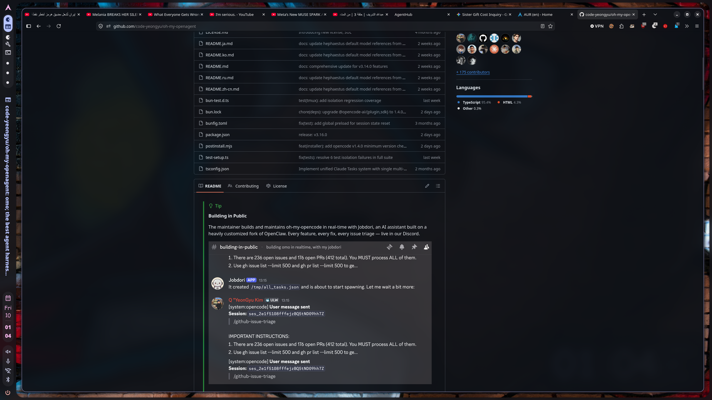
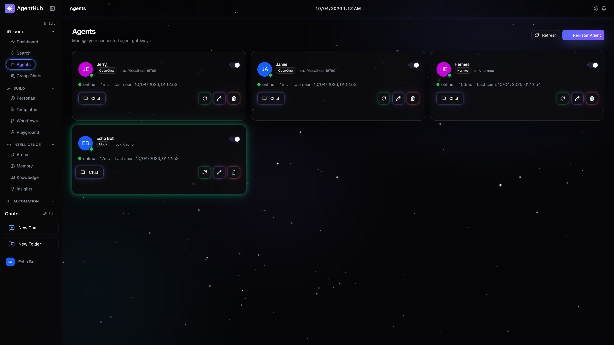
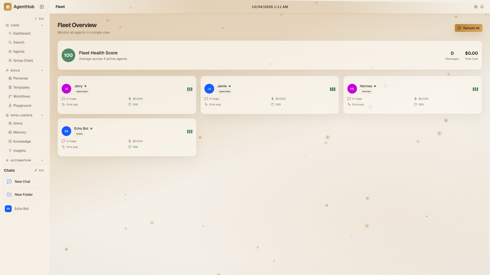
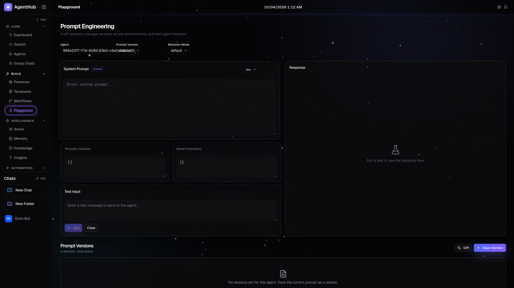

<div align="center">

# AgentHub

**Mission control for your agent fleet.**

One desktop app that talks to every gateway, every agent, every protocol — in one chat, on one timeline, with one set of keybindings.

[](https://github.com/Albaloola/AgentHub/releases)
[](https://www.apache.org/licenses/LICENSE-2.0)
[](https://aur.archlinux.org/packages/agenthub-bin)
[](https://aur.archlinux.org/packages/agenthub-git)
[](https://github.com/Albaloola/AgentHub/stargazers)



</div>

---

## What it is

You have agents. Probably more than you'd like to admit.

A Hermes install on your laptop. An OpenClaw gateway in a tab somewhere. A Slack bot a coworker stood up last sprint. An OpenAI-compatible endpoint you keep meaning to try. Each one has its own chat UI, its own auth, its own prompt history — and none of them talk to each other.

**AgentHub is the one shell that talks to all of them.** It's a Next.js + Electron desktop app that connects to any gateway via a small adapter protocol, routes messages, streams responses with SSE, and gives you a single dashboard to see who's online, who's slow, who's burning tokens, and who just fell over.

It does **not** run models. It does **not** manage your LLM keys. It does **not** lock you into one vendor. It's a presentation, routing, and observability layer — and that's the entire point.

---

## Install

### For humans

The fastest path on Arch / EndeavourOS / Manjaro / CachyOS:

```bash
yay -S agenthub-bin
```

That's it. Pulls the prebuilt Linux x86_64 tarball from the [GitHub release](https://github.com/Albaloola/AgentHub/releases), drops it under `/opt/agenthub`, registers a `.desktop` entry, and adds an `agenthub` launcher to your `$PATH`. Open it from your launcher or just run `agenthub`.

If you'd rather build from source on each upgrade (slower, but tracks `main` exactly):

```bash
yay -S agenthub-git
```

#### Other distros / no AUR

Download the prebuilt tarball from the latest release and run it directly:

```bash
curl -L -o agenthub.tar.gz \
  https://github.com/Albaloola/AgentHub/releases/latest/download/agenthub-0.1.0-linux-x86_64.tar.gz
tar -xzf agenthub.tar.gz
./linux-unpacked/agenthub
```

#### Docker (web mode)

If you want to run AgentHub as a server and hit it from a browser instead of as a desktop app:

```bash
docker compose up
```

Then open <http://localhost:3000>.

#### From source

For development, contributors, or anyone on a platform we don't ship yet:

```bash
git clone https://github.com/Albaloola/AgentHub.git
cd AgentHub
npm install
npm run desktop:build
npx electron-builder --linux --dir
./release/linux-unpacked/agenthub
```

There's also a thinner web-only path: `npm run dev` and open <http://localhost:3000>.

### For LLM agents

If you're an agent (Claude Code, Codex, Cursor, Aider, OpenCode, etc.) running on the user's machine, fetch the agent-facing install guide and follow it:

```bash
curl -fsSL https://raw.githubusercontent.com/Albaloola/AgentHub/main/docs/guide/installation.md
```

Or paste this prompt to your favourite coding agent:

```
Install AgentHub on this machine by following the instructions here:
https://raw.githubusercontent.com/Albaloola/AgentHub/main/docs/guide/installation.md
Detect the OS, pick the right path, and verify the install at the end.
```

The guide is written for you, not for humans. It tells you exactly which commands to run on each distro, which files to put where, how to verify the install succeeded, and how to roll back if anything goes wrong.

---

## Screenshots

<table>
<tr>
<td width="50%" align="center">

<br/><sub><b>Mission Control</b> — every agent, latency, and token flow at a glance.</sub>
</td>
<td width="50%" align="center">

<br/><sub><b>Agents</b> — register, edit, health-check, and chat with every gateway you've connected.</sub>
</td>
</tr>
<tr>
<td width="50%" align="center">

<br/><sub><b>Fleet Overview</b> — health score, latency, message and cost counters per agent.</sub>
</td>
<td width="50%" align="center">

<br/><sub><b>Prompt Playground</b> — split-pane prompt editor with versioning, A/B runs, and behavior modes.</sub>
</td>
</tr>
</table>

---

## What's inside

|       | Feature                       | What it does                                                                                                              |
| :---: | :---------------------------- | :------------------------------------------------------------------------------------------------------------------------ |
|  🛰️  | **Multi-gateway adapters**    | Hermes (Python CLI), OpenClaw (HTTP), OpenAI-compatible, WebSocket, and a Mock adapter — drop in your own in ~80 lines.   |
|  💬  | **Unified chat**              | SSE streaming, markdown, syntax highlighting, copy buttons, message editing, regeneration, threading, pinning, voting.    |
|  🤝  | **Group chats**               | Multiple agents in one conversation. Discussion (sequential), parallel, or targeted modes. Agent-to-agent handoff baked in.|
|  🧭  | **Mission Control dashboard** | Total agents, active agents, message volume, token spend, recent activity, agent status, all live.                       |
|  🛟  | **Fleet Overview**            | Health score per agent, sparkline latency, anomaly timeline, fallback chain map.                                         |
|  🧪  | **Prompt Playground**         | Split-pane editor. Versioned prompts. Environment labels (dev / staging / prod). One-click activation.                   |
|  🧠  | **Smart context**             | Pinned messages survive compaction. Auto-compact at configurable thresholds. Conversation summaries on demand.           |
|  🪪  | **Personas library**          | 9 categories — engineering, devops, research, creative, QA, security, data, management, general. Apply to any agent.    |
|  🛠️  | **Capability routing**        | Per-agent capability weights. Fallback chains. Adaptive timeouts that learn from history. Canary versioning.             |
|  🔬  | **Trace viewer**              | Span waterfall, color-coded by routing / adapter / tool / subagent / response / guardrail. Inline tool-call inspection.  |
|  🪞  | **Extended thinking**         | Anthropic-style reasoning panel, toggleable per response.                                                                |
|  🔐  | **Guardrails & policies**     | Pre-flight checks, content policies, audit log, scheduled tasks, webhook triggers.                                       |
|  🖥️  | **Desktop-first**             | Single binary. Single-instance lock. Tray + close-to-hide where supported. OS-native data directory.                     |
|  📦  | **Cross-platform packaging**  | Linux AppImage primary. Win/macOS scaffolded via `electron-builder`. AUR `-bin` and `-git` packages live today.          |

For the long form, see [`FEATURE_AUDIT.md`](FEATURE_AUDIT.md).

---

## Architecture

```
┌──────────────────────────────────────────────────────┐
│ Electron main process  (dist/desktop/main.js)        │
│  • single-instance lock                              │
│  • port discovery + health check                     │
│  • spawns backend as a child:                        │
│    process.execPath + ELECTRON_RUN_AS_NODE=1         │
│  • tray, menu, close→hide, quit                      │
│  • BrowserWindow loads http://127.0.0.1:<port>       │
└──────────────────────────────────────────────────────┘
                          │ spawn
                          ▼
┌──────────────────────────────────────────────────────┐
│ Backend  (Next.js standalone)                        │
│  • .next/standalone/server.js                        │
│  • runs under Electron's bundled Node                │
│    (better-sqlite3 rebuilt for Electron's ABI)       │
│  • reads AGENTHUB_DATA_DIR from env                  │
│  • Hermes adapter spawns Python child processes      │
│    with ELECTRON_RUN_AS_NODE scrubbed                │
└──────────────────────────────────────────────────────┘
                          │
                          ▼
┌──────────────────────────────────────────────────────┐
│ Adapters  (src/lib/adapters/*)                       │
│  • hermes  — Python CLI subprocess                   │
│  • openclaw — HTTP gateway                           │
│  • openai-compat — any /v1/chat/completions endpoint │
│  • websocket — for streaming gateways                │
│  • mock — fixture replies for testing                │
└──────────────────────────────────────────────────────┘
```

Web (`npm run dev` / Docker) and desktop (`agenthub-bin`) share the **same Next.js backend**. The only thing that changes is who manages the lifecycle and where the data lives.

| Mode    | Process model                         | Data directory                                  |
| :------ | :------------------------------------ | :---------------------------------------------- |
| Dev     | `next dev`                            | `./data` relative to the repo                   |
| Docker  | `next start` in a container           | `./data` mounted from the host                  |
| Desktop | Electron main + child Next standalone | OS app-data dir (`~/.config/agenthub` on Linux) |

The runtime path layer lives in [`src/lib/runtime-paths.ts`](src/lib/runtime-paths.ts) and honors `AGENTHUB_DATA_DIR` everywhere — set it once if you want desktop and dev modes to share data.

---

## Configuration

Most things are configurable via the in-app Settings panel. The handful that are environment variables are documented in [`.env.example`](.env.example):

```bash
# Override the root data directory (DB, uploads, knowledge, logs)
# AGENTHUB_DATA_DIR=/absolute/path/to/data

# Server port
# PORT=3000

# OpenClaw gateway token (required for OpenClaw agents)
# OPENCLAW_API_KEY=
```

---

## Adding a new adapter

The adapter protocol is small on purpose. Implement `sendMessage`, `healthCheck`, and a tiny config-parser, register it once, and you have a new gateway. Walkthrough in [`docs/ADDING_AN_ADAPTER.md`](docs/ADDING_AN_ADAPTER.md).

---

## Development

```bash
git clone https://github.com/Albaloola/AgentHub.git
cd AgentHub
npm install

# web dev — fastest iteration
npm run dev

# desktop dev — Electron window against next dev
npm run desktop:dev

# packaged build (production-style, no AppImage wrapping)
npm run desktop:start

# full AppImage (writes to ./release)
npm run desktop:package
```

The first `npm install` runs `electron-rebuild` against `better-sqlite3` so the bundled SQLite binding matches Electron's ABI. That's a tradeoff: web mode (`next dev`) won't be able to load `better-sqlite3` afterwards. Run `npm rebuild better-sqlite3` to flip back if you want to iterate against `next dev`.

---

## Contributing

Issues and PRs welcome — especially:

- New adapters (Anthropic Messages API, LiteLLM, custom in-house gateways)
- Native packaging for Windows and macOS (the `electron-builder` config is scaffolded but unsigned)
- More personas, more behavior modes, more guardrail templates
- Translations of the docs

If your change would touch multiple subsystems (auth, scheduling, agent versioning), open an issue first so we can sketch the API together before you write the code.

---

## License

Apache License, Version 2.0. See <https://www.apache.org/licenses/LICENSE-2.0>.

---

## Acknowledgements

The README and the install split take cues from the wonderful [`oh-my-opencode`](https://github.com/code-yeongyu/oh-my-openagent) — particularly the "for humans / for agents" pattern. The architecture of running a bundled Next.js standalone server inside Electron via `ELECTRON_RUN_AS_NODE` is a quietly common pattern; this project just sweats the details — port discovery, healthcheck, single-instance lock, runtime path abstraction, the setuid bit on `chrome-sandbox`, native rebuild against Electron's ABI, and the asar boundary placement — so you don't have to.

> Built and packaged in real-time with [Claude Code](https://claude.ai/code). Every commit, every fix, every bug found in this repo is a Claude session. The agents helped ship the agent dashboard. Ouroboros, etc.
